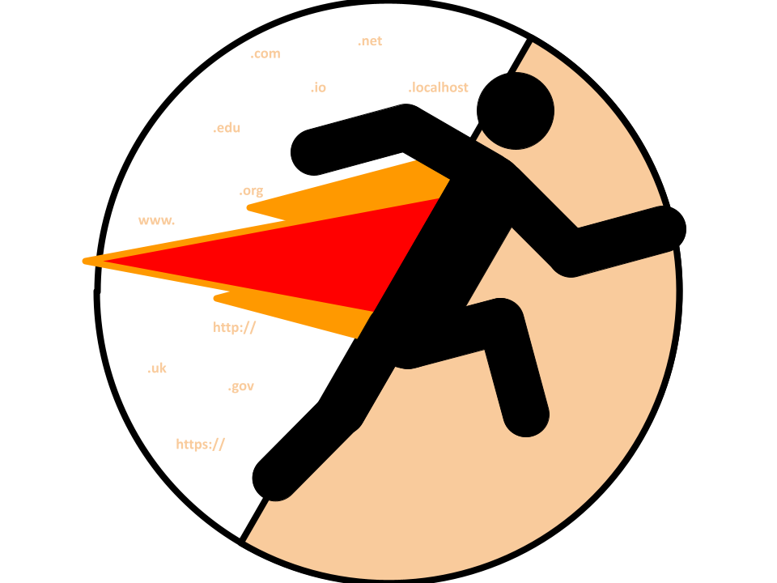

# Streak Everywhere

## Overview

This is a Chrome extension that tracks how many days you've visited website domains, and how many days you've visited website domains *in a row* - your *streak*. Every time you visit a page, a popup will appear to show your current streak.  

You can click the extension in your pinned extensions bar to see all your streaks, how many times you've visited pages, and what your highest streak has been for a specific page. The info is automatically sorted by highest current streak.  

Press load more to view all websites urls ever visited. Use the search bar to find a specific website url and it's associated data.

## Installation

### For Google Chrome:

1. Download all the code as a zip. 
2. Extract everything into your folder of choice.
3. Go to your extension settings (`chrome://extensions/`).
4. Turn on developer mode (top right corner).
5. Click load unpacked, and select the folder that you extracted the zip into.
6. Start streaking.

### For Others:

I dont know :(